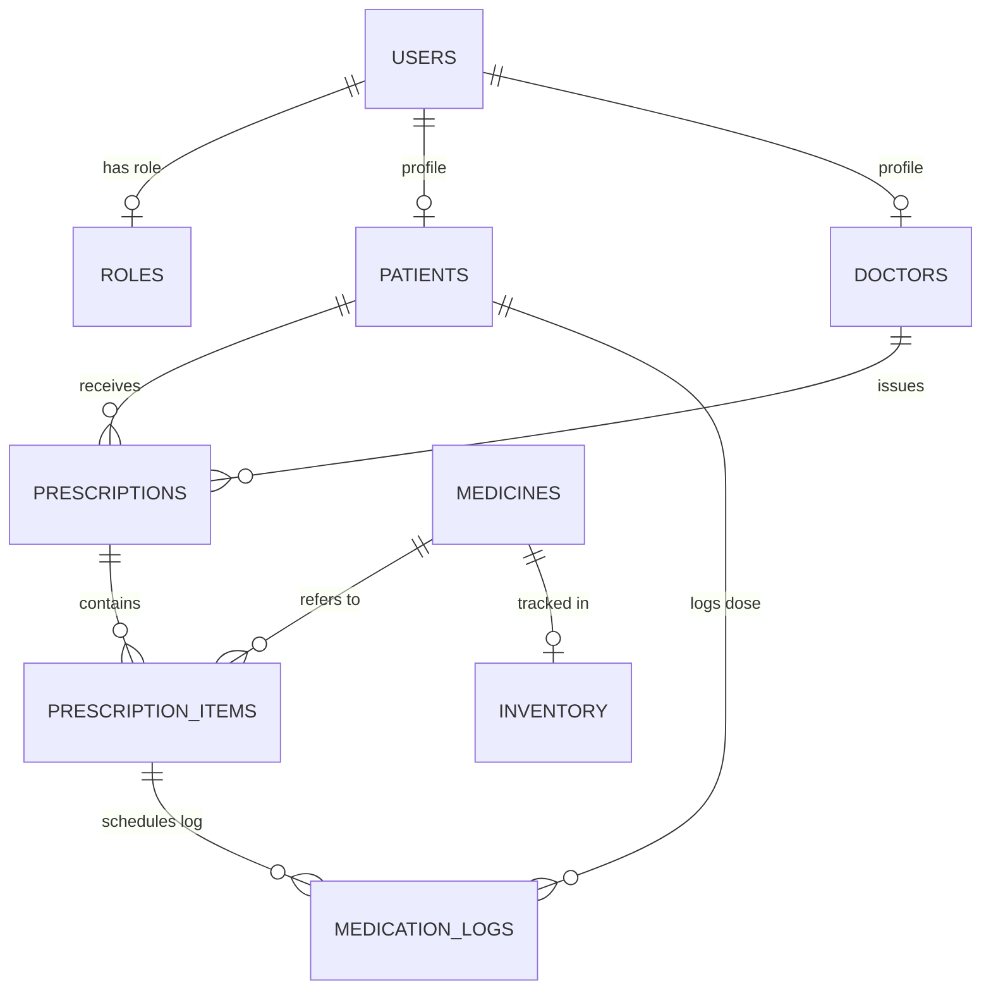

# Medicare Nexus AI - Intelligent Medication Copilot

> **Production-Grade Commercial AI Healthcare SaaS Platform**  
> *Built with Spring Boot 3 (Java 21/25), React 18, TypeScript, Material UI Obsidian Dark System, and Gemini AI Engine.*

---

## 🌟 Product Overview

**Medicare Nexus AI** is an intelligent medication copilot designed to transform clinical medication management, patient adherence tracking, pharmacy supply chain forecasting, and executive hospital administration into an AI-first healthcare operating system.

Designed according to modern commercial SaaS standards (Apple, OpenAI, Linear, Vercel), every workflow features quiet, context-aware artificial intelligence driving proactive clinical decisions.

---

## 🎨 Key Commercial Architectural Highlights

- 🩺 **Physician Portal**: Automated clinical regimen evaluation, drug interaction analysis, duplicate therapeutic checks, and stock inventory auto-deduction.
- 💊 **Patient Portal**: Daily medication schedule timeline, 1-click adherence tracking (**Taken / Missed**), active streak metrics, multi-language daily guidance, and **interactive custom prescription Q&A**.
- 🌐 **Multi-Language AI Engine**: Real-time natural language synthesis in **English**, **తెలుగు (Telugu)**, **हिन्दी (Hindi)**, **Español (Spanish)**, **Français (French)**, and **Deutsch (German)** with automatic prompt language detection.
- 📦 **Pharmacy Operations**: Stock depletion velocity forecasting, batch expiry monitoring, reorder priority alerts, and inventory stock management.
- 🛡️ **Executive Administration**: Operational summary briefing, clinical activity tracking, adherence risk watchlists, user permission governance, and master catalog oversight.
- 🎨 **Unified Design System**: Minimalist 4-color palette (`#0B0B0D` Obsidian Dark, `#15171C` Surface, `#F5F5F7` Primary Text, `#6E8BFF` Accent) with zero visual noise or neon distractions.

---

## 🔐 Account Quick Switcher (Pre-Configured Credentials)

The top bar features an active account switcher for testing different organizational roles:

| Role | Email Address | Password | Core Capabilities |
| :--- | :--- | :--- | :--- |
| **Physician** | `doctor@medicare.com` | `doctor123` | Clinical regimen analysis, drug interaction review, prescription issuance |
| **Patient** | `patient@medicare.com` | `patient123` | Daily schedule timeline, 1-click dose logger, adherence streak, multi-language custom Q&A |
| **Pharmacy** | `staff@medicare.com` | `staff123` | Inventory stock management, depletion velocity forecast, batch expiry alerts |
| **Administrator** | `admin@medicare.com` | `admin123` | System operations briefing, user account management, medicine catalog master view |

---

## 🛠️ Technology Stack

### Backend
- **Framework**: Java 21 / 25, Spring Boot 3.3.0
- **Security**: Spring Security 6, JWT (Stateless Authentication)
- **Persistence**: Spring Data JPA, Hibernate 6, H2 Database (In-Memory) / MySQL
- **AI Reasoning**: Google Gemini API (`GeminiAiService`) with safety guardrails & multi-language fallback engine
- **API Documentation**: OpenAPI 3 / Swagger (`springdoc-openapi-starter-webmvc-ui`)

### Frontend
- **Framework**: React 18, Vite 5, TypeScript 5
- **Design System**: Material UI (MUI v5), Emotion, Custom Commercial Obsidian Theme (`#0B0B0D`, `#15171C`, `#F5F5F7`, `#6E8BFF`)
- **State & Routing**: Redux Toolkit, React Router DOM v6
- **HTTP Client**: Axios with JWT Interceptor
- **Notifications**: Notistack

---

## 📐 Entity Relational Architecture



---

## 🚀 Installation & Running Locally

### Prerequisites
- **JDK**: Java 21 or Java 25 installed
- **Node.js**: Node 18+ and `npm` installed
- **Maven**: Apache Maven 3.9+ (or included Maven command)

---

### 1. Start Spring Boot Backend

```bash
# Navigate to backend directory
cd backend

# Run backend application (Port 8088)
mvn spring-boot:run
```

- **API Base Endpoint**: `http://localhost:8088/api`
- **Swagger Interactive API Documentation**: `http://localhost:8088/swagger-ui.html`
- **H2 Database Console**: `http://localhost:8088/h2-console` (JDBC URL: `jdbc:h2:mem:medicare_db`, User: `SA`, Password: *(leave blank)*)

---

### 2. Start React + Vite Frontend

```bash
# Navigate to frontend directory
cd frontend

# Install dependencies (if needed)
npm install

# Build & launch Vite development server (Port 3000)
npm run dev
```

- **Production Frontend Application**: `http://localhost:3000`

---

## 🛡️ Medical AI Safety Protocols

1. **Non-Diagnostic Constraint**: The AI is programmed to strictly explain existing prescriptions without diagnosing new conditions or modifying prescribed dosages.
2. **Context-Aware Safety**: Answers highlight food timing, drug interaction alerts, side-effect profiles, and safety precautions.
3. **Multi-Language Reasoning**: Guarantees accurate clinical translations in Telugu, Hindi, Spanish, French, German, and English.

---

## 📄 License

Distributed under the **MIT License**.
